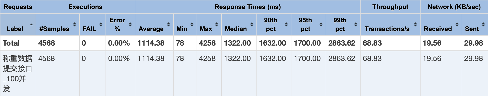

# result

## 测试结果

result 文件夹存储软件功能测试结果。

性能测试结果在：

- source/aws-test: 包含接口压力测试、边端离线测试和一些普通接口测试结果
- source/aws-img: 包含图像识别模型性能测试结果

## 软硬件验收

在 5.21 进行软硬件验收。

### 材料

1. 软硬件验收表格
2. 电脑和电源线

### 流程

#### 软件描述

本研究提出并实现了一套融合多协议通信、图像识别与数据管理的农业果实称重云端软件。

软件的整体架构设计采用云边协同的模式：在农场边端实时采集果实图像与重量信息，并使用基于 YOLO 的图像识别技术识别出果实种类，最后发布称重消息；在云端订阅电子秤上报的称重消息，完成后续的数据处理与存储。

软件支持通过 MQTT、HTTP、CoAP 等多种通信协议发布称重消息，适配多类型称重硬件，可实现灵活接入与快速部署。软件使用 Spring Boot + Vue 技术构建农场数据管理与可视化平台，提供了高效且丰富的信息管理功能以及多个维度下数据的可视化。


#### 软件成果

1. 云端服务
2. 边端服务
3. 后台管理界面
4. 电子秤模拟器


#### 测试方法

对本软件的测试分为功能测试和性能测试。

软件功能测试中，对核心需求用例进行测试，测试环境和测试
流程如下：

1. 测试环境：一台 8G 内存、8 核 CPU 的 MacOS 系统。
2. 测试流程：按照软件部署架构，使用 Docker Compose 技术组织各个应用容器并完成软件部署。最后通过 Web 界面、RestClient 接口测试工具和电子秤模拟器对各个功能进行测试并给出结论。


软件性能测试中，由于果实图像种类识别功能和称重数据提交功能是影响软件性能的关键功能，因此对这两个功能进行性能测试。

对果实图像种类识别功能的性能测试中，其测试环境和测试方法如下：

1. 测试环境：4 核 CPU, 31.4GB 内存, 2 个 Tesla T4 GPU。
2. 测试流程：使用 Ultralytics 提供的性能测试库对训练出来的果实图像识别最佳模型 best.pt 进行测试，测试数据则采用训练集数据。

对称重数据提交功能的性能测试中，其测试环境和测试方法如下：

1. 测试环境：8 核 CPU, 8GB 内存的 Docker 容器。
2. 测试流程：根据软件压力测试的方法来对称重数据提交接口进行性能测试，通过测试软件 JMeter 模拟 HTTP 并发请求来统计各项性能指标。首先启动称重相关服务，包含 Spring 应用服务、EMQX 集群以及 MySQL 数据库服务，分别以并发数 100、200 和 500 对提交称重数据接口进行测试，Ramp-up Time(负载增长时间) 设为 30s，Hold Time(稳定负载时间) 设为 35s。

#### 功能测试

1. 简要展示和介绍源代码；
2. 通过 docker 完成软件部署；
3. 展示和介绍软件；
4. 对[论文](../thesis/out/main.pdf)中设计的测试用例进行测试。
   1. 提交称重数据用例测试
   2. 处理待办记录用例测试
   3. 称重记录统计分析用例测试
   4. 配置电子秤用例测试
   5. 用户认证和授权用例测试
   6. 果实图像识别用例测试

#### 性能测试

首先对训练出来的果实图像识别模型进行性能测试，测试结果如下图所示，模型使用 PyTorch 框架训练，推理时间为 19.42 毫秒，帧率为 51.49 FPS，且在 mAP50-95 指标下的得分为 0.5823，适用于精度和推理速度之间的平衡。


训练模型得到标准化混淆矩阵图，图中的标准化混淆矩阵可以看出，模型在多个类别上表现出色。例如，apple(苹果)、banana(香蕉) 和 carrot(胡萝卜) 等类别的预测准确率都超过了 90%。然而，某些类别的分类效果较差，chilli_pepper(辣椒)的准确率为 62%，并且容易被误分类为 corn(玉米) 或其他类别。总体来说，模型在多数类别上的表现良好，大部分类别的置信度都在 0.7 到 1.0 之间。


综上所述，训练出来的果实图像识别模型在精度与推理速度之间达到平衡，模型在多数类别上的识别效果表现良好。

接着对称重数据提交服务接口进行性能测试，测试结果如下图所示，从上至下显示了并发数为 100、200 和 500 下的压力测试结果表格，每个表格从左至右显示的条目分别是测试标题、样本数、失败数、错误率、平均响应时间、最小响应时间、最大响应时间、响应时间中位数、90%响应时间、95%响应时间、99%响应时间、吞吐量、网络接收数据量、网络发送数据量。




- 在 100 并发下，软件性能表现较好，响应时间在 1 秒内，大部分请求能够在合理时间内完成，吞吐量也较为稳定。此时软件能够处理较高的负载；
- 在 200 并发下，响应时间明显增加，超过了 2 秒，并且最大响应时间接近 9 秒。吞吐量略有下降，软件开始在中等负载下显现出性能下降的迹象。虽然软件能够处理较高并发，但开始显示出压力；
- 在 500 并发下，性能显著下降，平均响应时间超过了 5 秒，最大响应时间接近 16 秒，90% 的请求响应时间超过 10 秒。吞吐量保持不变或略微下降，说明软件在高负载下的性能有严重瓶颈，无法有效处理 500 并发请求。此时软件可能面临资源瓶颈。

从上述分析可以知道，在 8 核 CPU, 8GB 内存的硬件条件下，软件可以高效地处理超过 200 台电子秤的并发请求，适合于中小型农场的部署使用。如果将并发数提高到 500，可以考虑升级硬件资源。

#### 总结

软件测试完成，这里做一个总结。首先给出了软件的测试方法，包括软件的测试环境和测试流程。

在功能测试部分，针对需求分析阶段定义的核心功能用例进行了全面测试，包括电子秤管理、果实管理、作业管理、用户管理、称重记录处理、统计分析等模块，所有功能均通过测试并展示了相关界面截图和测试数据。

性能测试部分重点评估了果实图像识别模型和称重数据提交接口的性能表现：YOLOv8 模型在测试集上达到了 0.5823 的 mAP50-95 指标，推理速度为 51.49FPS；称重数据接口在 200 并发下保持稳定，吞吐量达到预期水平。

测试结果表明，软件各项功能和非功能需求均已实现，在精度和性能方面达到了设计目标，能够满足中小型农场的使用需求。

## 笔记

### jmeter 测试脚本

```sh
pip install pymeter
python test.py
```

### emqtt-bench 测试命令

```sh
emqtt_bench conn -h 127.0.0.1 -p 1883 -u result -P result -c 500
```
