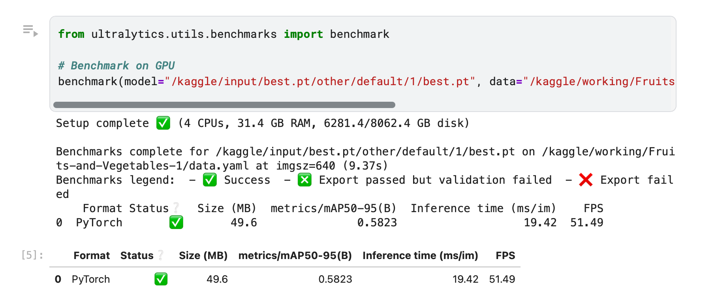
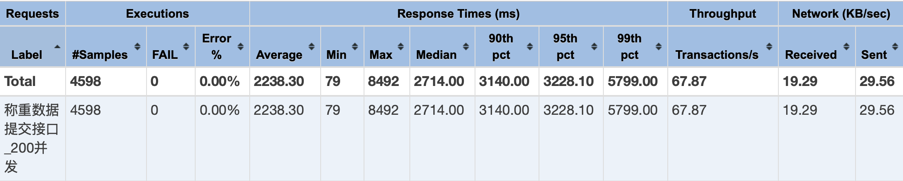
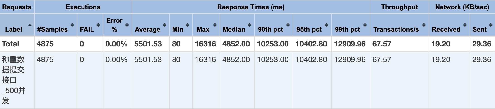

# 答辩

## 准备材料

1. 三份论文
2. 五份评分表格
3. USB（已存入答辩 PPT、演示视频等）
4. 电脑和电源线
5. Apple Watch（计时和录音）

## 流程

1. 设好闹钟 7:00，提前一个小时到场 (8:00 左右)
2. 检查准备材料是否带齐再出发
3. 上交材料给秘书
4. 手机开启 Zone 勿扰模式
5. 快到自己时，手表开启录音
6. 上台前，手表开始计时

## PPT 稿子

### PPT 封面

尊敬的各位老师，大家好。我是计算机科学与技术专业的本科生江志航，我的毕业设计课题是《农业果实称重云端软件的设计与实现》，我的指导老师是霍秋艳老师。

### 目录

接下来，我将从选题背景、实现目标与方法、需求分析、设计与实现、成果展示以及总结与展望这六个部分汇报本次课题的内容。

### 选题背景封面

首先我介绍一下课题的背景。

### 1

念完三段话

### 2

果实称重作为农业生产管理中的一个关键环节，具有重要的现实意义。它不仅直接影响市场定价和经济效益，也为精细化管理提供数据支撑。

然而，目前的果实称重主要依赖人工，不仅增加了劳动力成本，还存在数据处理繁琐、决策支持滞后等问题。

因此，开发一个具备自动识别和远程管理能力的果实称重软件系统，就显得尤为必要和有价值。

### 3

云计算、边缘计算和图像识别等先进技术的广泛应用，推动了智慧农业的快速发展，催生了大量功能各异的农业管理软件。当前市面上的软件主要存在这四个方面的不足。

根据 PPT 简要说明这四个不足。

### 实现目标与方法封面

为了解决这些问题，本课题的目标是构建一套融合图像识别、数据管理与多协议通信的果实称重云端软件系统。

### 1

软件的整体架构设计采用云边协同的模式：在农场边端实时采集果实图像与重量信息，通过图像识别技术识别出果实种类，最后发布称重消息；在云端订阅电子秤上报的称重消息，完成后续的数据处理与存储。

### 2

软件使用这些技术来完成开发。

根据 PPT 简要介绍技术。

### 需求分析封面

下面进行软件的需求分析，给出软件的功能建模和数据建模。

### 1

根据 PPT 简要介绍三个问题和痛点。

### 2

根据 PPT 简要介绍称重流程。

### 3

根据 PPT 简要介绍四个功能模块。

### 4

根据 PPT 简要介绍用例图。

### 5

根据 PPT 简要介绍数据建模。

### 6

下面进行需求的汇总。

### 设计与实现封面

下面对软件的设计进行介绍，包括架构设计、数据库设计以及核心的功能设计。

### 1

软件的整体架构采用云边协同的模式进行设计，将靠近农场一端称为边端，远离农场一端称为云端。

TODO:简要介绍通信流程。

该架构主要的优势是实现了两端数据处理的独立性。

### 2

在分层架构上，软件可以划分为五层：应用层、通信层、网关层、服务层和数据层。

TODO:简要介绍各个层级的通信。

### 3

根据 PPT 介绍数据设计。

### 4

下面对软件核心功能——称重数据处理功能的设计进行介绍。

### 5

称重数据处理功能的实现类图如图所示，图中给出了各个核心类。

### 6

下面对称重数据处理功能中的果实种类识别功能进行介绍。

根据 PPT 介绍果实模型训练的细节。

### 成果展示封面

软件成果主要包括后台管理平台、电子秤模拟器、云端服务和边端服务，下面进行简要的展示。

### 1

首先展示后台管理平台，后台管理平台用于进行农场数据的管理和可视化。

这是用户中心，显示了用户的基本信息和支持的操作。通过各个按钮可以完成xx操作。

这是用户管理界面，管理员可以在这里进行对用户的管理。通过各个按钮可以完成xx操作。

### 2

这是待办记录管理界面，管理员可以在这里人工提交处理失败的称重数据。通过各个按钮可以完成xx操作。

这是电子秤管理界面，管理员可以在这里管理电子秤。通过各个按钮可以完成xx操作。

### 3

这是采摘作业管理界面，管理员可以在这里管理采摘作业。通过各个按钮可以完成xx操作。

这是果实管理界面，管理员可以在这里管理果实。通过各个按钮可以完成xx操作。

### 4

这是可视化的情况，点击导出按钮可以进行数据的导出。

### 5

这是电子秤模拟器。

根据 PPT 进行介绍。

### 6

这是对果实识别模型的性能测试结果。

根据 PPT 进行介绍。

### 7

这是对关键接口称重数据提交接口的接口压力测试结果。

根据 PPT 进行介绍。

### 8

这是边端离线测试的结果。

根据 PPT 进行介绍。

### 总结与展望

### 1

下面我对我的工作进行总结。

根据 PPT 进行介绍。

### 2

我的工作还存在一些不足，这是后续的工作计划。

根据 PPT 进行介绍。

### 结束语

以上就是我本次毕业设计的全部汇报，请各位老师批评指正！

## PPT 大纲

- 页面数 ~= count("####") + count("###")
- to doc: `pandoc defense.md -o defense.docx`

### 选题背景

#### 全球农业发展面临的挑战与机遇

随着全球人口增加，以及对高品质和安全农产品的期望提升，农业的可持续发展面临重大挑战。智慧农业技术不仅是应对这些问题的关键，也是提高产量与效率的重要手段。在这样的背景下，深入探讨智慧农业的应用将有助于解决未来农业发展的问题。

#### 果实称重的重要性

- 市场价值: 通过分析果实称重数据，可以有效优化市场定价和销售策略，改善供应链管理。这种数据驱动的方法提升了农产品的市场竞争力，从而进一步改善农业的经济效益，促进可持续发展。
- 对农业生产管理的影响: 果实称重能提供准确的产量数据，帮助农民合理安排种植和收获活动。这种精准的信息不仅提高作物的产量，还确保了其质量与管理效率的提升，为农业生产带来了显著好处。

#### 传统称重缺陷

- 时间成本: 人工称重耗费时间，在果实采摘高峰期显著增加人力与财务开支，降低工作效率，影响整体生产力。
- 准确性和管理问题: 人工干预常导致重量数据偏差，影响管理决策。同时，记录和数据管理方式复杂，增加了后续的操作难度。

#### 信息技术应用

- 云计算与数据处理: 云计算可以实现果实称重数据的实时采集，为果农提供数据分析，帮助其进行精准预测与市场决策。
- 边缘计算的作用: 边缘计算可以在网络环境不佳时仍保持数据处理迅速，确保果实称重的及时性与准确性，弥补通信延迟。
- 图像识别的优势: 极速的图像识别技术将果实的信息自动化处理，省去人工干预，从而使称重工作变得高效而精准。

#### 当前果实称重软件的不足

- 数据安全问题: 现有的软件在数据传输和存储方面存在风险。
- 软件通用性问题: 软件需支持多种通信协议，以满足不同型号电子秤的接入。
- 自动化问题: 现有软件自动化水平有限，尚需人工参与，亟待通过智能化手段加以改进。
- 准确性问题: 部分果实称重软件的精度和稳定性有待提高。

### 研究目标

#### 研究目标简述

基于以上背景，本文研究将深入调研农业生产活动，归纳与分析具体需求，利用云计算、边缘计算、图像识别等软件技术，设计并开发农业果实称重云端软件，实现智能化的农业数据处理、高效的信息管理以及数据的可视化，为智慧农场的果实采摘称重管理提供了一个高效、稳定且功能丰富的解决方案，有助于推动智慧农场的精准收获和数字化管理。

### 需求分析

#### 传统果实称重模式的问题和痛点

1. 人工称重的方式数据不可靠：称重人员在称重读数时存在疲劳、疏忽以及读数误差等人为因素的存在，获取的数据准确性难以保证。不可靠的数据将会影响到后续的生产决策；
2. 人工称重的方式在数据记录和管理上也较为繁琐：人工记录数据的方式无法实现数据的实时共享和高效分析，无法满足现代精准农业对数据快速处理和深度挖掘的需求；
3. 人工称重需要耗费大量的人力和时间，生产效率低下。

#### 称重流程分析

面对这些痛点和问题，本节针对性地设计了一个更高效、更智能的称重流程，如称重流程时序图所示。

<!-- 简要阐述操作流程 -->

上述操作自动化了称重信息的处理和存储，采摘人员只需刷卡即可完成所有称重步骤，后台收到数据后可以实时地完成数据的存储和分析。

#### 功能建模-工作分解

基于该称重流程，可以分析并归纳出四个模块的功能需求，分别是称重模块、用户模块、果实模块、作业模块，如工作分解图所示。

<!-- 简要阐述各个功能模块的功能 -->

#### 功能建模-用例图

基于此工作分解图，可以继续完成各个模块功能的用例设计。

<!-- 简要阐述用例图 -->

通过用例的设计，得出软件中存在的角色及他们在软件中所关联的功能，如用例图所示。

#### 功能建模-功能权限

从用例图中可以发现，各个角色有共同的功能，也有特有的功能，因此需要在后续的开发中做好权限控制，如用户功能权限表所示。在后续的开发中，需要根据此权限表进行设计与实现。

<!-- 简要阐述用户功能权限表 -->

#### 数据建模

完成上述功能需求的建模与分析后，继续进行数据建模。农业果实称重云端软件中，可以抽象出果实、称重记录、电子秤、采摘作业、用户、待办记录这六个实体对象，结合实际的业务场景，可以得到如下实体关系：

<!-- 简要阐述 ERD -->

#### 功能需求汇总

#### 非功能需求汇总

### 设计与实现

#### 软件部署架构

农业果实称重云端软件的整体架构采用云边协同的模式进行设计，将靠近农场一端称为边端，远离农场一端称为云端。云端完成主要的软件功能，包含数据处理、存储和可视化等。而边端作为云端的一个扩展，是为了实现称重数据的高速处理和离线提交而存在的。

1. 数据采集与上传：电子秤拍摄果实图像并识别种类，图像存储至边端 MinIO，称重数据通过 MQTT/HTTP 上传至网关；
2. 网关协议转换与认证：网关使用 EMQX 完成协议转换，基于 MySQL 从库认证电子秤后，将数据转发至 MQTT Broker 集群；
3. 消息处理与存储：MQTT Broker 任一节点接收消息并持久化，云端服务订阅消息并处理。
4. 云端解析与持久化：云端解析消息、读取果实图像，识别未知果实后写入 MySQL 主库，后台支持数据查看与补录。

<!-- 根据架构，简要阐述称重流程：

下面根据软件的部署架构，描述电子秤提交称重数据的通信流程：

(1)首先由电子秤拍摄果实图片，然后果实识别模块对果实种类进行识别并将果实图片存储至边端 MinIO 对象存储库，最后电子秤根据其所支持的协议（如 MQTT、HTTP 等）将称重数据提交至边端网关；

(2)网关处理电子秤的发出的请求，通过 EMQX 协议转换技术完成协议转换，通过读取 MySQL 从库数据完成电子秤信息认证和授权，最后将数据以 MQTT 协议的格式发送至 MQTT Broker 集群；

(3)MQTT Broker 接收到 MQTT 消息后，该集群内任一节点都可以处理请求并将消息持久化；

(4)云端服务订阅 MQTT Broker 集群中所有节点的消息，收到消息后进行消息解析，通过边端 MinIO 对象存储读取果实图片并持久化至本地 MinIO 对象存储。如果果实种类未知，则通过果实识别服务根据果实图像识别出果实种类。最后将称重处理的结果写入 MySQL 主库。

(5)至此已经完成称重数据的处理。此外，在后台管理界面，员工可以查看历史称重记录，管理员可以在待办界面处理待办，手动填写并提交处理失败的称重数据。

该架构主要的优势是实现了两端数据处理的独立性，对于边端，不管是提交称重数据还是存储果实图片，都只需在边端完成，不仅提高了数据处理速度，而且在网络受限的情况下也不会影响称重数据的处理。对于云端，则只需要订阅称重消息进行处理即可。

-->

#### 软件分层架构

软件可以抽象出五个层级，分别是应用层、通信层、网关层、服务层、数据层。各层作用如下：

<!-- 简要阐述各个层级：

应用层：该层可以理解为接口调用者，包含管理平台和电子秤，两者都通过调用后台提供的接口来完成数据的处理或展示；

通信层：该层负责协调应用层与网关层之间的通信流程。软件所支持的通信协议有四种，分别是 HTTP/HTTPS、MQTT、CoAP 和 STOMP。其中管理平台可以通过 HTTP/HTTPS 调用后台接口，而电子秤可以通过四种协议中任一一种来提交称重数据；

网关层：该层提供了接口路由和协议转换功能。应用层发来的请求根据接口路由导向服务层中对应的服务，协议转换功能则服务于电子秤，将不同协议统一转为 MQTT 协议，以 MQTT 协议继续进行后续通信；

服务层：该层完成具体的数据服务逻辑。包含四大模块，用户模块、果实模块、作业模块以及称重模块，各个模块相互依赖，共同协作，完成数据的查询和处理；

数据层：该层完成数据的持久化和缓存操作。MySQL 数据库用于持久化数据；Redis 数据库用于实现数据缓存功能；MQTT Broker 类似于消息队列，用于临时存储 MQTT 消息；MinIO 是对象存储库，主要用于储存果实图片，其中边端对象存储库用于临时存储果实图片，如果 MQTT Broker 中的称重消息和后台管理中的待办记录均以被清空，则可进行数据处理以节省存储成本，相对的，云端对象存储库则持久化地存储果实图片，用于后续进一步的分析； 

-->

根据软件部署架构图可以得到软件整体的通信流程和部署思路，根据软件分层架构图可以清晰地划分出功能模块，更高效地进行后续软件的开发。

#### 数据库设计

软件使用MySQL 作为数据库管理系统，采用InnoDB 存储引擎。在数据存储与分布方面，采用主从架构，在靠近农场边端部署从库，在云端服务器部署主库，主从库采用基于 GTID 的主从复制技术完成数据实时同步。

### 成果展示

#### 软件成果展示-后台管理界面

在一台 8G 内存、8核 CPU 的 MacOS 系统使用 Docker Compose 技术组织各个应用容器并完成软件部署。

<!-- 给出各页面展、各可视化结果展示并对其进行简要介绍。 -->

#### 软件成果展示-电子秤模拟器

<!-- 简要介绍模拟器 -->

#### 软件成果展示-果实识别模型

软件基于 YOLOv8 实现果实图像识别功能，训练数据集来源于 Kaggle 平台上的已经完成数据标注的 Fruits-360 数据集，从该数据集中挑选了来自 22 种不同果实的近两千张照片，将 70% 的数据作为训练集，20% 的数据作为验证集，10% 的数据作为测试集，使用 yolov8m 预训练模型作为基础，在单个 GPU P100 上训练 50 个 epoch(训练轮次)。训练完成后，将模型分别部署在云端和边端，提供给电子秤和后台服务进行使用。

测试环境：4 核 CPU, 31.4GB 内存, 2 个 Tesla T4 GPU。

模型推理时间为 19.42 毫秒，帧率为 51.49 FPS，且在 mAP50-95 指标下的得分为 0.5823，适用于精度和推理速度之间的平衡。

训练模型得到标准化混淆矩阵图，图中的标准化混淆矩阵可以看出，模型在多个类别上表现出色。例如，apple(苹果)、banana(香蕉) 和 carrot(胡萝卜) 等类别的预测准确率都超过了 90%。然而，某些类别的分类效果较差，chilli_pepper(辣椒)的准确率为 62%，并且容易被误分类为 corn(玉米) 或其他类别。总体来说，模型在多数类别上的表现良好，大部分类别的置信度都在 0.7 到 1.0 之间。

综上所述，训练出来的果实图像识别模型在精度与推理速度之间达到平衡，模型在多数类别上的识别效果表现良好。

#### 软件成果展示-压力测试

对称重数据提交功能的并发性能进行测试。其测试环境和测试方法如下：

(1)测试环境：8 核 CPU, 8GB 内存 的 Docker 容器。

(2)测试流程：根据软件压力测试的方法来对称重数据提交接口进行性能测试，通过测试软件 JMeter 模拟 HTTP 并发请求来统计各项性能指标。首先启动称重相关服务，包含 Spring 应用服务、EMQX 集群以及 MySQL 数据库服务，分别以并发数 100、200 和 500 调用称重数据提交接口，将负载增长时间设为 30s，稳定负载时间设为 35s。

接着对称重数据提交服务接口进行并发性能测试，测试结果如下三图所示，分别显示了并发数为 100、200 和 500 下的压力测试结果表格，每个表格从左至右显示的条目分别是测试标题、样本数、失败数、错误率、平均响应时间、最小响应时间、最大响应时间、响应时间中位数、90%响应时间、95%响应时间、99%响应时间、吞吐量、网络接收数据量、网络发送数据量。

在 100 并发下，软件性能表现较好，响应时间在 1 秒内，大部分请求能够在合理时间内完成，吞吐量也较为稳定。此时软件能够处理较高的负载；在 200 并发下，响应时间明显增加，超过了 2 秒，并且最大响应时间接近 9 秒。吞吐量略有下降，软件开始在中等负载下显现出性能下降的迹象。虽然软件能够处理较高并发，但开始显示出压力；在 500 并发下，性能显著下降，平均响应时间超过了 5 秒，最大响应时间接近 16 秒，90% 的请求响应时间超过 10 秒。吞吐量保持不变或略微下降，说明软件在高负载下的性能有严重瓶颈，无法有效处理 500 并发请求。此时软件可能面临资源瓶颈。

从上述分析可以知道，在 8 核 CPU, 8GB 内存的硬件条件下，软件可以高效地处理超过 200 台电子秤的并发请求，适合于中小型农场的部署使用。如果将并发数提高到 500，可以考虑升级硬件资源。

#### 软件成果展示-边端离线测试

对称重数据提交功能在断连场景下的消息处理能力进行测试。由于在实际部署中，边缘设备与云端服务可能因网络故障、容器重启等原因造成 MQTT 通信中断，本测试评估软件在断连恢复后，是否能迅速重建连接、重新订阅主题、补收断连期间消息，以此验证软件的容错性、恢复性能与可用性保障能力。其测试环境和测试方法如下：

(1)测试环境：一台 8G 内存、8核 CPU 的 MacOS 系统。

(2)测试流程：使用 Docker Compose 技术组织各个应用容器并完成软件部署；手动停止云端服务，持续一分钟以上；期间边端设备持续向 MQTT Broker 发布 500 条称重消息；最后启动云端服务，在 MQTT Broker 监控中心读取数据处理情况，确认是否成功处理 500 条称重消息。

下图显示了称重消息生产情况，横坐标为时间，纵坐标为称重消息的条数。边端在 15:00-15:01 之间一共发布了 500 条称重消息，期间云端和边端已处于断开连接的状态。

下图显示了称重消息消费情况，横坐标为时间，纵坐标为称重消息的条数。从图中可以看出，云端在 15:00-15:01 之间没有任何反应，在 15:02 重新启动云端服务，恢复与边端的连接，云端在 15:02-15:12 内陆续处理完所有的消息。

下图显示了云端称重消息处理的结果，可以看到成功处理了 500 条称重消息，消息全部成功接收，未发生丢弃，表明云端服务接收功能正常，可靠性高；无过期、队列满、消息过大的异常提示，表明软件状态平稳。

从上述分析可以知道，软件在断连恢复后能迅速重建连接、重新订阅主题并补收断连期间发布的所有称重消息。因此，在云端和边端断连场景下，软件具备一定的容错性、恢复性能与可用性保障能力。

手动停止云端服务，持续一分钟以上；期间边端设备持续向 MQTT Broker 发布 500 条称重消息；最后启动云端服务，云端成功处理了所有称重消息，软件可靠性高，无过期、队列满、消息过大的异常提示，软件状态平稳。

### 总结与展望

#### 工作总结

本研究深入调研农业生产活动，应用软件工程相关知识理论，归纳与分析具体需求，利用先进软件技术，设计出合理的系统架构并可开发农业果实称重云端软件，实现高性能且稳定可用的智能化农业数据处理流程、高效且丰富的信息管理功能以及多个维度下数据的可视化。

论文的工作如下：

(1)背景调研和技术概述。对农业果实称重云端软件的研究背景进行阐述，分析其在农业生产中的重要性和应用前景，并对国内外相关研究现状进行综述。同时，对软件设计和开发过程中涉及到的理论和相关技术进行概述，包括 Spring 技术栈、YOLO 目标检测算法、EMQX 网关框架等。

(2)软件需求与可行性分析。调研农业生产活动，主要分析了果实收获和称重入库的具体流程，进行需求分析与可行性分析，其中需求分析包括功能需求分析和非功能需求分析，可行性分析包括技术可行性、经济可行性和社会可行性三个方面的分析。

(3)软件设计与实现。在需求分析的基础上，选用当下可靠的框架和技术，进行了软件架构设计、数据库设计、称重模块的功能设计与实现、果实模块的功能设计与实现、作业模块的功能设计与实现和用户模块的功能设计与实现。

(4)软件部署与测试。通过使用容器技术组织各个应用，在本地完成部署，然后完成功能测试和性能测试，对测试结果进行理论分析，给出相关结论。

进一步简化后的版本，更适合作为提纲或目录使用：

(1) 背景与技术概述
说明项目背景、应用价值，综述相关研究与核心技术。

(2) 需求与可行性分析
分析业务流程、系统需求和技术、经济、社会可行性。

(3) 设计与实现
进行系统架构设计，完成各功能模块的开发。

(4) 部署与测试
完成容器化部署，进行功能与性能测试并分析结果。

#### 后续工作展望

通过软件的设计、实现和测试，本文的农业果实称重云端软件可以满足中小型农场的使用，能够保证数据的准确性和可靠性，为农业生产提供有力的支持。但是，本文的研究仍然存在一些不足之处，主要体现在以下几个方面：

(1)软件所实现的 EMQX 静态集群在使用上存在一定的局限性。静态集群在伸缩性和灵活性上较差，无法更高效地增删 EMQX 节点，以满足扩展变更需求。后续工作中，可以考虑基于 Mnesia 之类的分布式数据库，实现一个 EMQX 动态集群，为农业果实称重云端软件提供更加强大的数据处理能力。

(2)在数据存储方面存在一定的局限性。随着业务不断扩展，系统产生的数据会以数量级增长，存储方面，本软件采用了 MySQL，但随着数据量的增加，单机数据库的性能瓶颈逐渐显现。为应对这一挑战，后续工作中可以考虑进行数据库分片，通过水平分片将数据分散到多个数据库实例上，以提高查询性能和扩展性。此外也可以考虑进行数据归档与清理，定期归档历史数据，清理过期或不常用的数据，减轻数据库负担。通过这些优化措施，能够有效支持系统的可扩展性和高性能需求。

(3)深入挖掘称重数据的应用价值。未来可结合采集的果实图像训练质量分级模型，实现果实品质评估与智能化分级，提升数据利用效率与管理智能化水平。

### 致谢

感谢各位评委老师的聆听，请批评指正！
